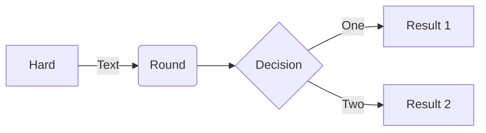
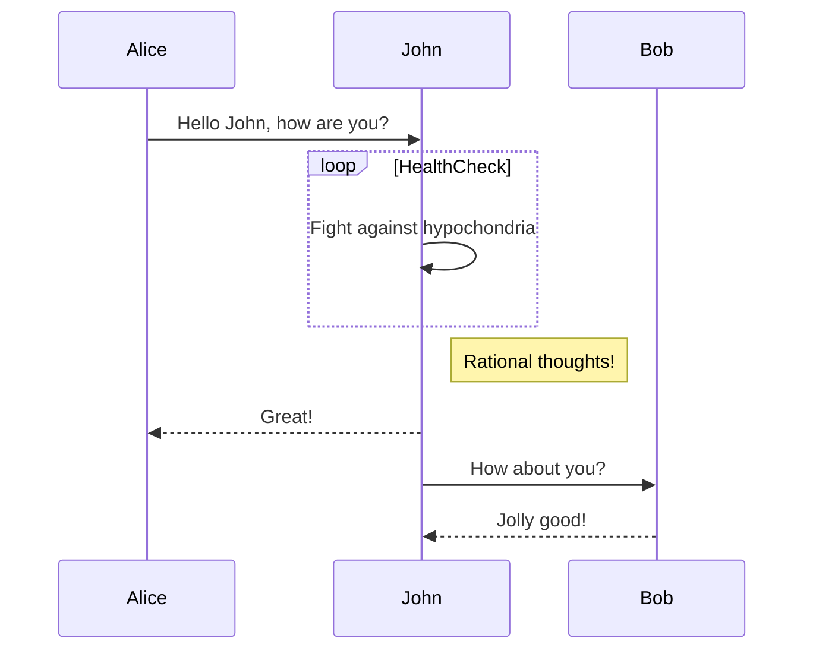

# Experiment

## Footnotes

m = ax + b [^1]

--- 

## Alerts

> [!NOTE]
> This is a helpful piece of information.

> [!WARNING]
> Be careful with this step.

--- 

## Mermaid

Flowchart 

Sequence diagrams 

--- 

## Expand

Click to expand!

This is the hidden content. It can even include
`code` or other **Markdown**.

--- 

[^1]: this is a reference!
